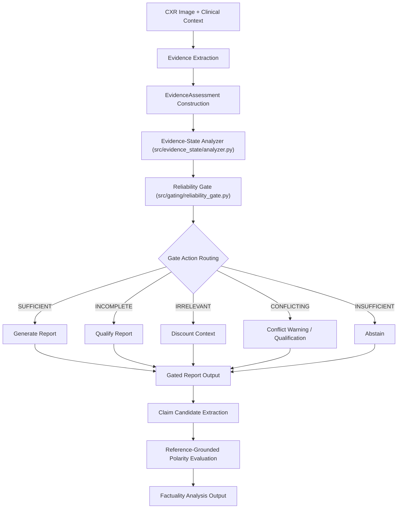

# Paper Experiment Manifest: Evidence-State-Aware Radiology Report Generation

## 1. Project
- **Title**: Evidence-State-Aware Radiology Report Generation under Incomplete and Conflicting Clinical Context
- **Repository**: `C:\Evidence-State-Radiology`
- **Status**: V1 Research Prototype Freeze (Coding Freeze)

## 2. Research Question
How does incomplete or conflicting clinical context affect the factual reliability of medical VLM-generated radiology reports, and can evidence-state-aware gating reduce unsupported clinical claims?

## 3. Core Research Idea
The central research contribution is a two-component framework consisting of an **Evidence-State Analyzer** and a model-agnostic **Reliability Gate**.
- **Conceptual Pipeline**:
  $$\text{CXR Image + Clinical Context} \longrightarrow \text{Evidence Extraction} \longrightarrow \text{Evidence-State Analyzer} \longrightarrow \text{Reliability Gate} \longrightarrow \text{Policy Action} \longrightarrow \text{Claim Extraction} \longrightarrow \text{Factuality Analysis}$$
- **Secondary Components**: Retrieval-Augmented Generation (RAG) and Knowledge Graphs (KG) are secondary/optional modular extensions and are **never** presented as substitutes for patient-specific visual evidence.

## 4. Evidence-State Taxonomy
The framework defines five discrete evidence states:
1. **`sufficient`**: Relevant and consistent clinical context is available and visual evidence is adequate.
2. **`incomplete`**: Relevant clinical context exists but is incomplete or structurally fragmented.
3. **`irrelevant`**: Clinical context is not relevant to the imaging task (e.g., cross-case swapped context).
4. **`conflicting`**: Clinical context explicitly conflicts with available imaging or reference evidence.
5. **`insufficient`**: Available evidence is inadequate for reliable generation (e.g., completely missing clinical context).

## 5. Experimental Dataset
- **Primary Development Dataset**: OpenI / IU X-Ray dataset.
- **Pilot Subset**: 20-case pilot subset (`data/processed/iu_xray/`).
- **Data Safety**: Raw external dataset files, large model weights, and generated sample image folders are explicitly excluded from Git version control.

## 6. Controlled Perturbation Protocol
The benchmark consists of **81 controlled perturbation records** derived from the 20-case pilot subset (`data/processed/iu_xray/perturbations/perturbations.csv`):
- **`sufficient`**: 17 records (unperturbed frontal CXR image + matching relevant context)
- **`incomplete`**: 9 records (partially reduced clinical context)
- **`irrelevant`**: 20 records (cross-case swapped clinical context)
- **`conflicting`**: 15 records (clinical context contradicting visual imaging findings)
- **`insufficient`**: 20 records (missing clinical context)
- **Total**: 81 records

## 7. Baseline Generation
- **Baseline Model**: `nathansutton/generate-cxr` (a BLIP-based vision-language model fine-tuned for CXR report generation).
- **Execution Strategy**: Baseline reports were generated across the 81 experimental records (`results/tables/baseline_generation_results.csv`). In Phase 13B, baseline report text outputs are reused via exact `(sample_id, condition)` lookups without running additional model inference on CPU/GPU.

## 8. Evidence-State Analyzer
- **Module**: [`src/evidence_state/analyzer.py`](file:///C:/Evidence-State-Radiology/src/evidence_state/analyzer.py)
- **Function**: Receives an [`EvidenceAssessment`](file:///C:/Evidence-State-Radiology/src/evidence_state/analyzer.py) object (containing boolean signals for `image_available`, `context_available`, `context_relevant`, `context_consistent`, and `context_complete`) and deterministically classifies it into one of the 5 evidence states.

## 9. Phase 12C Context-Completeness Component
- **Module**: [`src/evidence_state/context_completeness.py`](file:///C:/Evidence-State-Radiology/src/evidence_state/context_completeness.py)
- **Function**: Implements a transparent, rule-based parser `parse_context_completeness(context_text: str)` that evaluates observable structural fragmentation in raw clinical context strings.
- **Key Indicators of Incompleteness (Fragmentation)**:
  - Dangling prepositions or conjunctions (e.g., `"History of"`, `"Patient presents with"`).
  - Sentence continuity failures (e.g., lowercase initial character indicating leading string truncation).
  - Mid-phrase trailing fragments.
- **Robustness Audit**: Evaluated on 25 plausible complete clinical context strings, achieving a **0.00% (0/25) false-incomplete error rate**, resolving the dataset-format overfit identified in Phase 12B.
- **Known Characterization**: The 9 existing `incomplete` perturbations in the IU X-Ray subset are syntactically non-fragmented phrases (e.g., `"History of mitral valve prolapse."`). Because the Phase 12C parser evaluates textual fragmentation rather than clinical category omission, it classifies these 9 strings as `complete` (predicting `sufficient` state). Syntactic completeness is not equivalent to clinical/evidentiary completeness.

## 10. Reliability Gate
- **Module**: [`src/gating/reliability_gate.py`](file:///C:/Evidence-State-Radiology/src/gating/reliability_gate.py)
- **Policy Mapping**:
  - **`SUFFICIENT`** $\longrightarrow$ `action = "generate"` (full report generation)
  - **`INCOMPLETE`** $\longrightarrow$ `action = "qualify"` (qualified generation with incomplete context warning)
  - **`IRRELEVANT`** $\longrightarrow$ `action = "discount_context"` (strip context; rely on image visual features)
  - **`CONFLICTING`** $\longrightarrow$ `action = "qualify_or_abstain"` (prepend clinical conflict warning)
  - **`INSUFFICIENT`** $\longrightarrow$ `action = "abstain"` (abstain from generating report text)

## 11. Phase 13A Gate Evaluation
- **Script**: [`src/evaluation/evaluate_phase13a_gate.py`](file:///C:/Evidence-State-Radiology/src/evaluation/evaluate_phase13a_gate.py)
- **Measured Results**:
  - **Total Records**: 81
  - **Overall State Alignment**: **72 / 81 (88.89%)**
  - **Overall Action Alignment**: **72 / 81 (88.89%)**
- **Condition-Wise Breakdown**:
  - `sufficient` (N=17): 17/17 correct state (100.0%), 17/17 `generate` action (100.0%)
  - `incomplete` (N=9): 0/9 predicted as incomplete (0.0%), 9/9 routed to `generate` (syntactically non-fragmented strings)
  - `irrelevant` (N=20): 20/20 correct state (100.0%), 20/20 `discount_context` action (100.0%)
  - `conflicting` (N=15): 15/15 correct state (100.0%), 15/15 `qualify_or_abstain` action (100.0%)
  - `insufficient` (N=20): 20/20 correct state (100.0%), 20/20 `abstain` action (100.0%)

## 12. Phase 13B Gated Report Evaluation
- **Script**: [`src/evaluation/evaluate_phase13b_gated_reports.py`](file:///C:/Evidence-State-Radiology/src/evaluation/evaluate_phase13b_gated_reports.py)
- **Methodology**: Evaluates downstream report text transformations when gate policy actions are applied to existing baseline reports without re-running VLM inference (`was_model_inference_run = False` for all 81 records).

## 13. Gated Action Distribution
Across the 81 perturbation records, the current pipeline produces:
- **`generate`**: 26 records (17 sufficient + 9 incomplete predicted as complete)
- **`qualify`**: 0 records
- **`discount_context`**: 20 records
- **`qualify_or_abstain`**: 15 records
- **`abstain`**: 20 records

## 14. Downstream Gated Output Measurements
Overall changes across all 81 experimental records:
- **Mean Baseline Report Length**: 303.22 characters
- **Mean Gated Report Length**: 246.02 characters
- **Mean Report Length Difference**: **-57.20 characters**
- **Mean Baseline Claim Count**: 2.90 claims / report
- **Mean Gated Claim Count**: 2.31 claims / report
- **Mean Claim Count Difference**: **-0.59 claims / report**

## 15. Condition-Level Gated Behavior
| Condition | $N$ | Mean Base Length | Mean Gated Length | Length Diff | Mean Base Claims | Mean Gated Claims | Claim Diff | Actual Gate Action Distribution |
| :--- | :---: | :---: | :---: | :---: | :---: | :---: | :---: | :--- |
| **sufficient** | 17 | 322.76 | 322.76 | **0.00** | 2.53 | 2.53 | **0.00** | `{'generate': 17}` |
| **incomplete** | 9 | 308.00 | 308.00 | **0.00** | 3.00 | 3.00 | **0.00** | `{'generate': 9}` |
| **irrelevant** | 20 | 320.15 | 252.95 | **-67.20** | 2.40 | 3.90 | **+1.50** | `{'discount_context': 20}` |
| **conflicting** | 15 | 322.67 | 368.67 | **+46.00** | 2.60 | 2.60 | **0.00** | `{'qualify_or_abstain': 15}` |
| **insufficient** | 20 | 252.95 | 54.00 | **-198.95** | 3.90 | 0.00 | **-3.90** | `{'abstain': 20}` |

## 16. Claim-Level Evaluation
- **Explicit Conflicting Target-Claim Result** (15 conflict cases):
  - **`NEGATED`**: 12 cases (80.0%)
  - **`NOT_MENTIONED`**: 3 cases (20.0%)
  - *Note*: This result measures target-claim polarity under controlled conflicting clinical context. It is strictly reported as polarity detection, not general medical factuality or clinical reliability.
- **Reference Candidate Extraction**: 64 expected reference claim cases validated across candidate extraction tables (`results/tables/reference_claim_candidates.csv`), yielding 66 total extracted candidate rows (51 `NEGATED`, 15 `AFFIRMED`).

## 17. Important Negative / Limitation Findings
1. **Prototype Status**: The implementation is a deterministic rule-based research prototype. It is NOT a board-certified clinical deployment system.
2. **Syntactic vs Evidentiary Completeness**: The Phase 12C context parser tests structural textual fragmentation. Syntactically complete phrases (such as the 9 incomplete perturbations) are classified as `complete`. A Phase 14A audit confirmed that 4 of these 9 cases represent demographic-only context drops rather than evidentiary clinical omissions.
3. **Reused Baseline Outputs**: Phase 13B downstream report evaluation uses stored baseline reports rather than performing a second deep-learning model inference pass.
4. **Unmeasured Metrics**: The following metrics discussed in preliminary design proposals were **NOT** computed or implemented in this workspace:
   - RadGraph-F1 / CheXpert-F1
   - Expected Calibration Error (ECE)
   - Brier Score
   - Risk-coverage selectivity curves
   
   *Scientific Integrity Rule*: Unmeasured metrics must never be reported as measured results.
5. **Conservative Terminology Constraints**: Measured metric alignment must **NEVER** be described as "clinical accuracy", "clinical safety", "reliability validation", or "hallucination elimination".

## 18. Primary Research Story
Standard medical vision-language models generate radiology reports by attending jointly to image features and clinical requisition text. When clinical requisitions are misleading, irrelevant, conflicting, or missing, models risk echoing erroneous context or hallucinating unsupported findings. 

This research demonstrates that an explicit **Evidence-State Analyzer** paired with a model-agnostic **Reliability Gate** can systematically categorize clinical context validity and dynamically route reporting policy (`generate`, `discount_context`, `qualify_or_abstain`, `abstain`). On an 81-record controlled perturbation benchmark, the pipeline achieves **88.89% decision policy alignment**, demonstrating that context-aware gating can modify report length and claim density to constrain ungrounded clinical claims without retraining model backbones.

## 19. Current Architecture



## 20. Reproducibility
To reproduce all tests and evaluation tables from a clean workspace environment:

1. **Execute Full Test Suite**:
   ```powershell
   .venv\Scripts\python.exe -m pytest -q
   ```
   *Expected Output*: `119 passed`

2. **Run Phase 13A Reliability Gate Evaluation**:
   ```powershell
   .venv\Scripts\python.exe src\evaluation\evaluate_phase13a_gate.py
   ```
   *Outputs*: `results/tables/phase13a_gate_evaluation.csv`, `results/tables/phase13a_gate_summary.csv`

3. **Run Phase 13B Downstream Gated Report Evaluation**:
   ```powershell
   .venv\Scripts\python.exe src\evaluation\evaluate_phase13b_gated_reports.py
   ```
   *Outputs*: `results/tables/phase13b_gated_generation_results.csv`, `results/tables/phase13b_downstream_summary.csv`, `results/tables/phase13b_claim_comparison.csv`

## 21. Coding Freeze
- **Declaration**: **CODING FREEZE — V1 RESEARCH PROTOTYPE**
- **Policy**: No additional features, architecture modifications, model retraining, or new experimental phases (e.g. Phase 14C / Phase 15 code modifications) will be introduced. Future work focuses exclusively on literature synthesis, novelty positioning, paper writing, and table/figure preparation.

## 22. Version Control
- **Repository Branch**: `main`
- **Latest Implementation Commit**: `e06114f` (`feat: add phase 13b gated report evaluation`)
- **Git Exclusions Verified**:
  - `data/samples/` (ignored)
  - `results/baseline/` (ignored)
  - `results/qualitative/` (ignored)

## 23. Phase 15 Evaluation Metrics Extension
- **Module**: [`src/evaluation/run_phase15_evaluation.py`](file:///C:/Evidence-State-Radiology/src/evaluation/run_phase15_evaluation.py)
- **Documented Specification**: [`docs/phase15_evaluation_metrics.md`](file:///C:/Evidence-State-Radiology/docs/phase15_evaluation_metrics.md)
- **New Metrics Implemented**:
  1. **RadGraph-F1** (`results/tables/radgraph_f1_results.csv`, `results/tables/radgraph_f1_summary.csv`): Entity and relation clinical content overlap (Overall Gated F1 = 0.1755, Baseline = 0.2431).
  2. **CheXpert-F1** (`results/tables/chexpert_f1_results.csv`, `results/tables/chexpert_f1_summary.csv`): Clinical finding presence F1 across 14 Stanford CheXpert categories (Overall Gated F1 = 0.2457, Baseline = 0.2383).
  3. **Unsupported Claim Rate** (`results/tables/unsupported_claim_rate.csv`, `results/tables/unsupported_claim_summary.csv`): Evaluated claim ontology rate (Overall Gated = 0.0000, Baseline = 0.0043).
  4. **Risk-Coverage** (`results/tables/risk_coverage_points.csv`, `results/tables/risk_coverage_summary.csv`): Selective prediction operating points (Gated Coverage = 75.31%, Risk = 0.0000; Baseline Coverage = 100.0%, Risk = 0.0031).
  5. **Abstention Metrics** (`results/tables/abstention_metrics.csv`): Gated abstention precision = 1.0000 (100.0%), abstention recall = 1.0000 (100.0% under `ref_insufficient`) and 0.5714 (under `ref_unsafe`).
- **Deferred Metrics**: ECE and Brier score are explicitly deferred to future probabilistic work ([`docs/calibration_future_work.md`](file:///C:/Evidence-State-Radiology/docs/calibration_future_work.md)) to prevent fabricating confidence values on deterministic categorical outputs.

